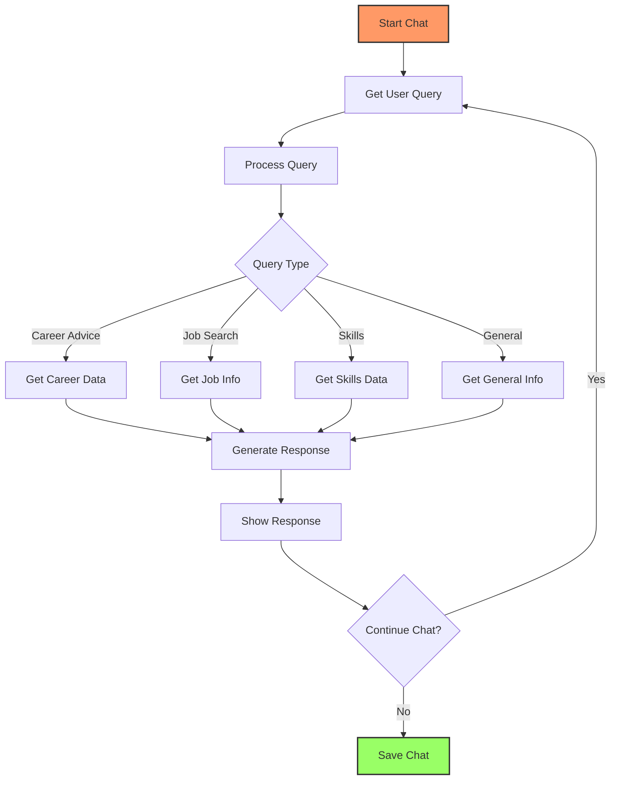

```mermaid
flowchart TD
    A[Start Chat] --> B[Get User Query]
    B --> C[Process Query]
    
    C --> D{Query Type}
    
    D -->|Career Advice| E[Get Career Data]
    D -->|Job Search| F[Get Job Info]
    D -->|Skills| G[Get Skills Data]
    D -->|General| H[Get General Info]
    
    E & F & G & H --> I[Generate Response]
    I --> J[Show Response]
    
    J --> K{Continue Chat?}
    K -->|Yes| B
    K -->|No| L[Save Chat]
    
    style A fill:#f96,stroke:#333,stroke-width:2px
    style L fill:#9f6,stroke:#333,stroke-width:2px
``` 