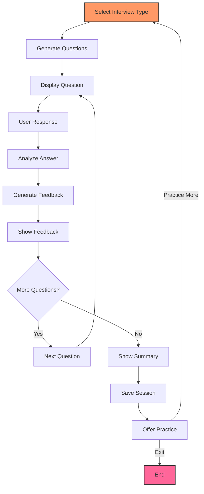

```mermaid
flowchart TD
    A[Select Interview Type] --> B[Generate Questions]
    B --> C[Display Question]
    
    C --> D[User Response]
    D --> E[Analyze Answer]
    
    E --> F[Generate Feedback]
    F --> G[Show Feedback]
    G --> H{More Questions?}
    
    H -->|Yes| I[Next Question]
    I --> C
    
    H -->|No| J[Show Summary]
    J --> K[Save Session]
    K --> L[Offer Practice]
    
    L -->|Practice More| A
    L -->|Exit| M[End]
    
    style A fill:#f96,stroke:#333,stroke-width:2px
    style M fill:#f69,stroke:#333,stroke-width:2px
``` 