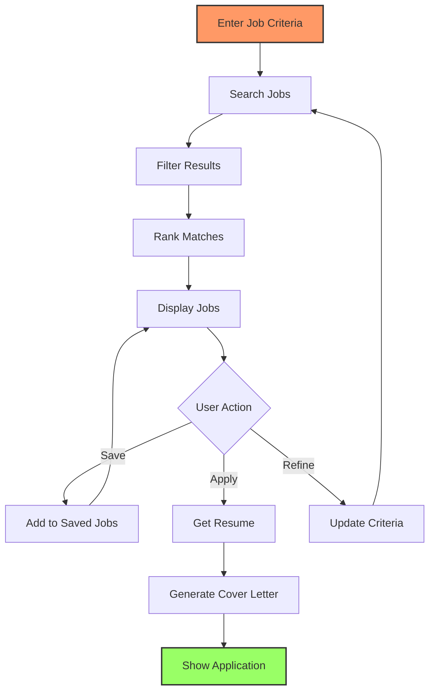

```mermaid
flowchart TD
    A[Enter Job Criteria] --> B[Search Jobs]
    B --> C[Filter Results]
    C --> D[Rank Matches]
    D --> E[Display Jobs]
    
    E --> F{User Action}
    
    F -->|Save| G[Add to Saved Jobs]
    G --> E
    
    F -->|Apply| H[Get Resume]
    H --> I[Generate Cover Letter]
    I --> J[Show Application]
    
    F -->|Refine| K[Update Criteria]
    K --> B
    
    style A fill:#f96,stroke:#333,stroke-width:2px
    style J fill:#9f6,stroke:#333,stroke-width:2px
``` 