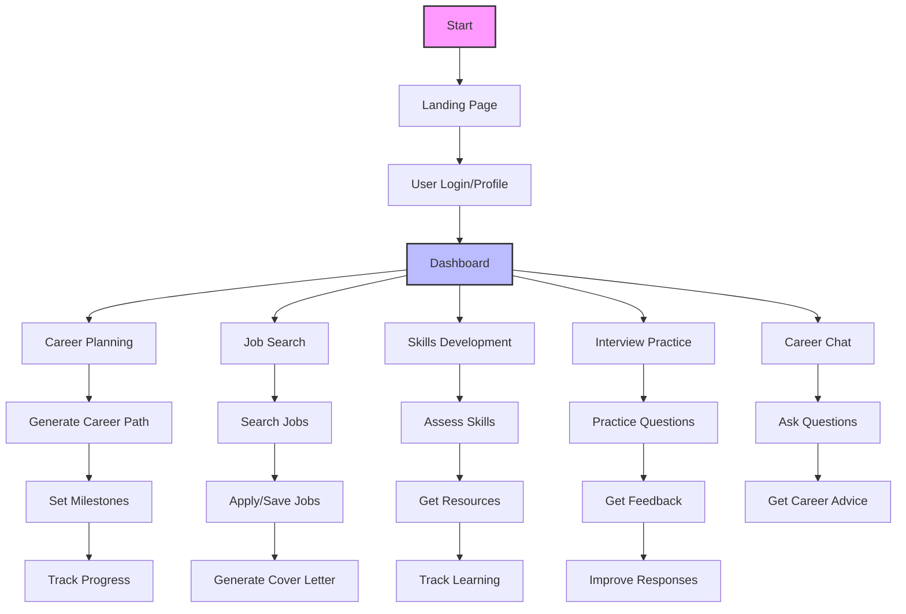

```mermaid
flowchart TD
    A[Start] --> B[Landing Page]
    B --> C[User Login/Profile]
    
    C --> D[Dashboard]
    
    D --> E[Career Planning]
    D --> F[Job Search]
    D --> G[Skills Development]
    D --> H[Interview Practice]
    D --> I[Career Chat]
    
    E --> J[Generate Career Path]
    J --> K[Set Milestones]
    K --> L[Track Progress]
    
    F --> M[Search Jobs]
    M --> N[Apply/Save Jobs]
    N --> O[Generate Cover Letter]
    
    G --> P[Assess Skills]
    P --> Q[Get Resources]
    Q --> R[Track Learning]
    
    H --> S[Practice Questions]
    S --> T[Get Feedback]
    T --> U[Improve Responses]
    
    I --> V[Ask Questions]
    V --> W[Get Career Advice]
    
    style A fill:#f9f,stroke:#333,stroke-width:2px
    style D fill:#bbf,stroke:#333,stroke-width:2px
``` 