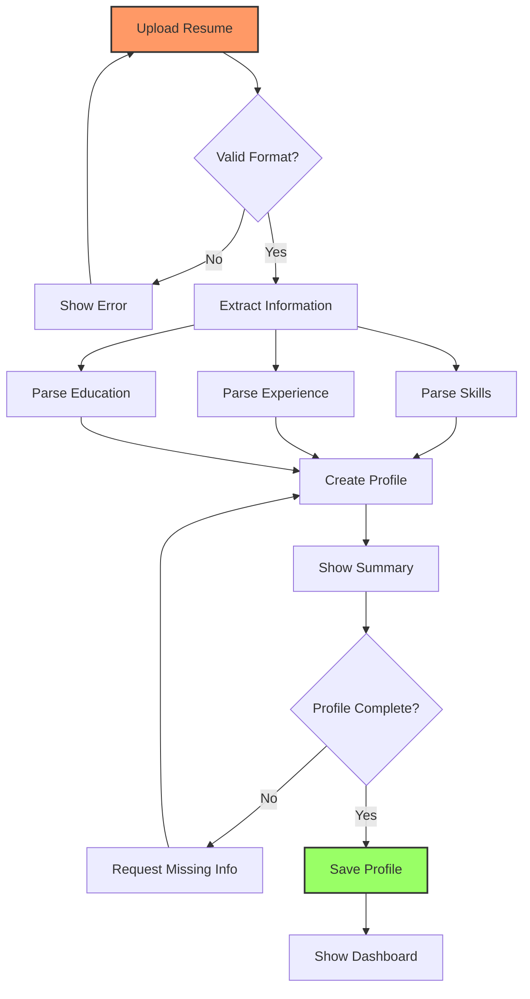

```mermaid
flowchart TD
    A[Upload Resume] --> B{Valid Format?}
    B -->|No| C[Show Error]
    C --> A
    
    B -->|Yes| D[Extract Information]
    D --> E[Parse Skills]
    D --> F[Parse Experience]
    D --> G[Parse Education]
    
    E & F & G --> H[Create Profile]
    H --> I[Show Summary]
    I --> J{Profile Complete?}
    
    J -->|No| K[Request Missing Info]
    K --> H
    
    J -->|Yes| L[Save Profile]
    L --> M[Show Dashboard]
    
    style A fill:#f96,stroke:#333,stroke-width:2px
    style L fill:#9f6,stroke:#333,stroke-width:2px
``` 