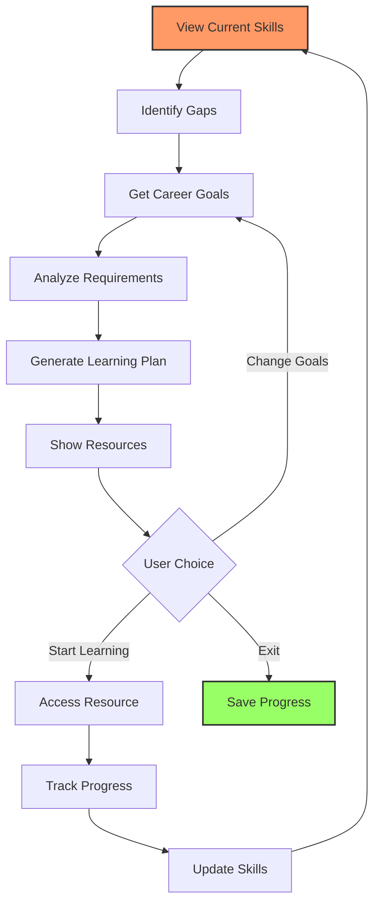

```mermaid
flowchart TD
    A[View Current Skills] --> B[Identify Gaps]
    B --> C[Get Career Goals]
    
    C --> D[Analyze Requirements]
    D --> E[Generate Learning Plan]
    
    E --> F[Show Resources]
    F --> G{User Choice}
    
    G -->|Start Learning| H[Access Resource]
    H --> I[Track Progress]
    I --> J[Update Skills]
    J --> A
    
    G -->|Change Goals| C
    G -->|Exit| K[Save Progress]
    
    style A fill:#f96,stroke:#333,stroke-width:2px
    style K fill:#9f6,stroke:#333,stroke-width:2px
``` 